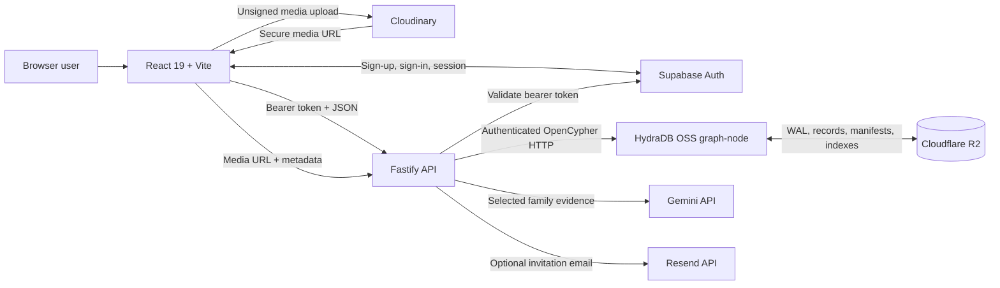
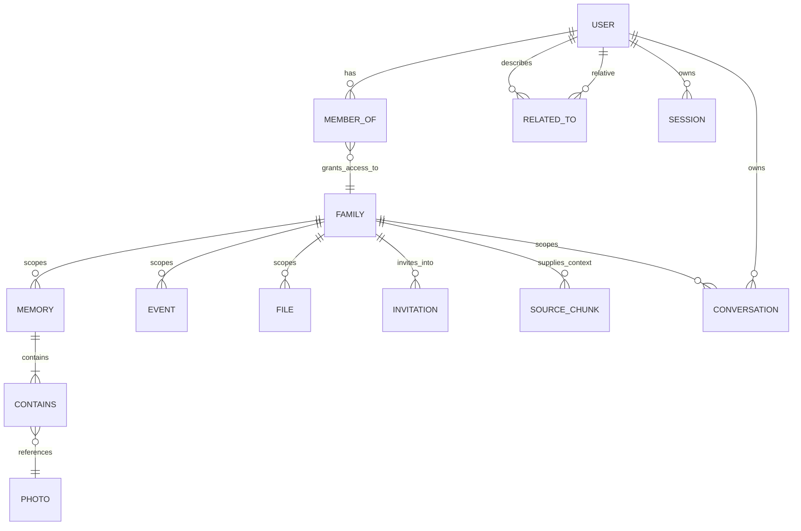
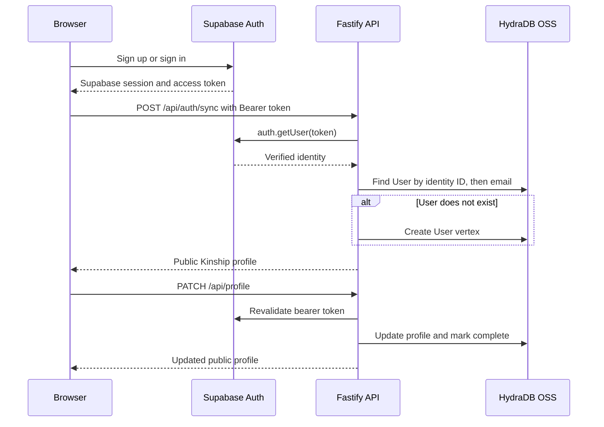
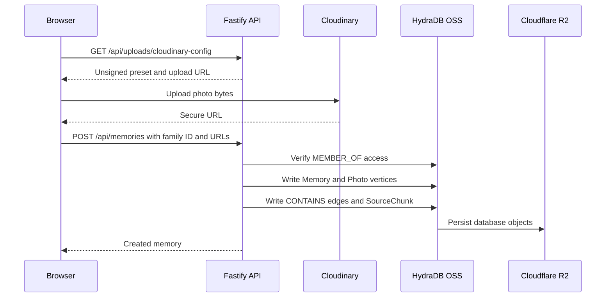
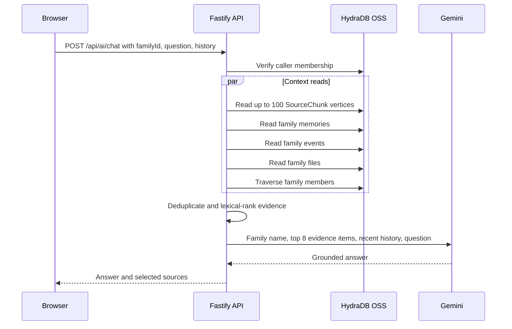
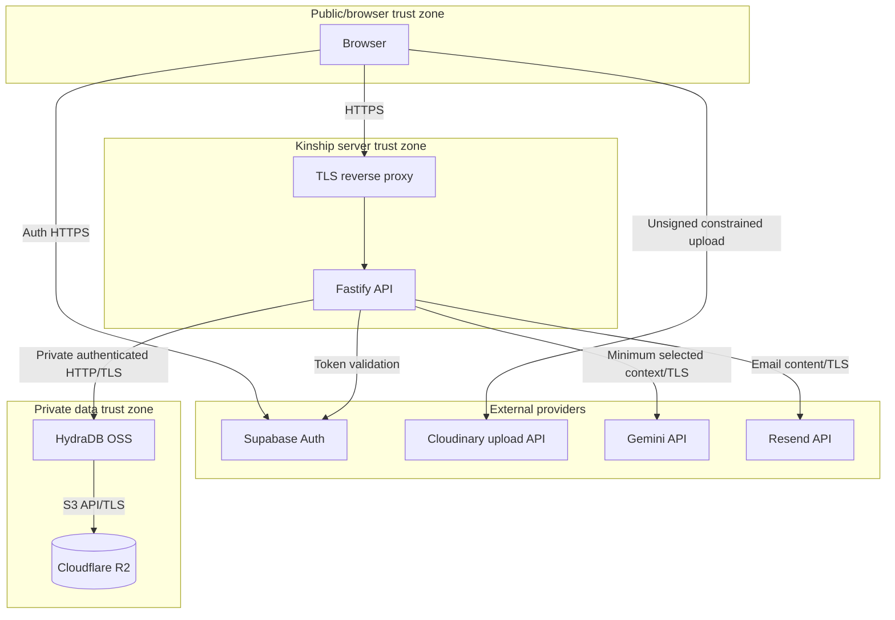
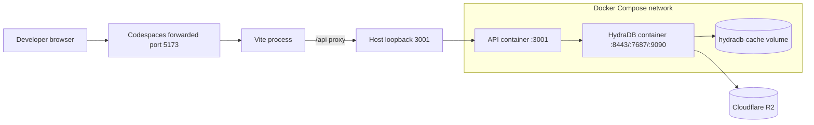
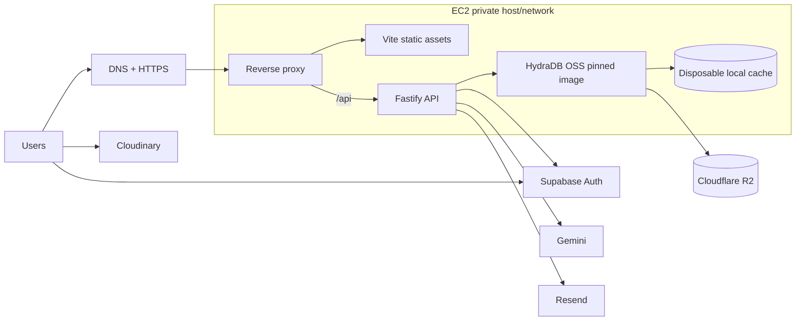

# Kinship architecture

## Scope and system statement

Kinship is a browser application and API for a private, multi-family archive. The architecture separates identity, application data, media bytes, durable database objects, and generated text:

- Supabase Auth proves who a user is. It is authentication only.
- The Fastify API validates requests and makes all family authorization decisions.
- Self-hosted HydraDB OSS is the primary application, graph, and retrieval-context database.
- Cloudflare R2 is the S3-compatible durable object store used by HydraDB.
- Cloudinary stores user-uploaded media bytes.
- Gemini generates Ask Kinship answers from evidence selected by the API.
- Resend optionally delivers family invitations and supports the API's legacy email-auth routes.

The hosted HydraDB API is not used. `compose.yaml` starts the upstream open source HydraDB container in Kinship's own network. The API calls that container directly.

## Component topology

## Runtime components

### React/Vite frontend

`src/app.tsx` defines browser routes for the landing page, authentication, onboarding, activity, family, memories, events, files, invitations, and Ask Kinship. `AppShell` restores the Supabase browser session, places its access token in the API client, calls `POST /api/auth/sync`, and redirects incomplete profiles to onboarding.

The browser calls API paths on the same origin. During development, Vite proxies `/api` to `http://127.0.0.1:3001`. Media uploads are different: after obtaining the authenticated unsigned-upload configuration from Fastify, the browser sends the bytes directly to Cloudinary and then sends Cloudinary's secure URL and metadata to Kinship.

### Fastify API

`server/app.ts` is the HTTP boundary. It provides:

- Zod validation for params, queries, and JSON bodies.
- Supabase bearer-token validation and an optional legacy cookie-auth path.
- Family membership and role checks.
- Repository orchestration for every application record.
- Cloudinary upload configuration.
- Deterministic family-scoped retrieval and Gemini generation.
- Optional Resend delivery.
- CORS, origin enforcement for non-safe methods, rate limiting, and normalized errors.

### Supabase Auth only

The frontend creates and restores Supabase sessions. The API receives the Supabase access token as `Authorization: Bearer ...` and calls `supabase.auth.getUser(token)`. On a valid identity, the API finds or creates the corresponding Kinship `User` vertex in HydraDB.

Supabase is not an application database in this design. It does not store family profiles beyond auth metadata, memberships, family records, memories, events, files, relationship edges, invitations, retrieval chunks, or conversations.

### HydraDB OSS and R2

`createRepository` constructs `HydraDbRepository` when `DATA_PROVIDER=hydradb`. `HydraDbClient` calls HydraDB's JSON query endpoint with a bearer token, namespace header, graph ID, cell ID, parameter map, and causal or strong consistency setting.

The Compose service uses the upstream OSS image and maps R2's S3-compatible credentials into HydraDB's object-store configuration. HydraDB's local `/data/cache` volume is a cache. R2 is the durable database layer beneath the node and stores HydraDB's WAL, graph records, manifests, and indexes.

Kinship itself never reads or writes HydraDB's R2 objects. It uses the database query API, leaving persistence format, snapshots, and object-store coordination to HydraDB.

### Cloudinary

Cloudinary contains uploaded photos, images, audio, video, PDFs, and documents. The API returns only the configured cloud name, unsigned preset, and upload URL. It does not proxy bytes or expose a Cloudinary API secret.

After upload, HydraDB stores the resulting URL and product metadata. Therefore Cloudinary is the media object store, but HydraDB remains the system of record for how that media belongs to a family archive.

### Gemini

Gemini receives a prompt containing the family name, up to eight selected evidence records, the latest eight supplied history messages, and the user's question. The system instruction requires evidence-only answers and citations. Temperature is `0.2`.

Gemini is not allowed to query HydraDB directly. The API controls family scope and evidence selection before data crosses the Gemini trust boundary.

### Resend

Resend is optional for family invitations. Without a key, invitation creation still persists and returns a local preview URL. The legacy API-managed registration, email verification, and reset-password routes also use Resend; in production those legacy verification/reset sends fail if no key is configured.

## Repository abstraction

`KinshipRepository` is the persistence contract used by services and routes. Two implementations exist:

- `HydraDbRepository`: the deployment implementation, backed by the self-hosted HydraDB OSS HTTP API.
- `MemoryRepository`: a process-local implementation for tests and lightweight development.

The abstraction covers health, users, sessions, families, memberships, relationships, invitations, memories, events, files, source chunks, and conversations. It prevents route handlers from depending on HydraDB transport details, but it does not make the memory implementation production-capable. Memory state disappears on restart and cannot coordinate multiple processes.

## Graph model

HydraDB vertices use a numeric HydraDB `id`, also retained as `vertexId`, and a UUID/string application identifier stored as `appId`. Domain foreign keys such as `familyId`, `userId`, and `sourceId` are properties used for scoping and lookup.

Implemented vertex labels:

| Label | Purpose |
| --- | --- |
| `User` | Kinship profile and, for legacy auth, password state |
| `Session` | Hashed legacy cookie session token and expiry |
| `Family` | Family space, owner reference, image, and invite code |
| `Invitation` | Expiring invite capability and optional invited email |
| `Memory` | Album metadata and a JSON copy of photo URLs |
| `Photo` | Individual Cloudinary photo URL associated with a memory |
| `Event` | Date, category, location, description, and image URL |
| `File` | Cloudinary URL, media type, size, description, and uploader |
| `SourceChunk` | Retrieval title/content/source metadata |
| `Conversation` | Per-user chat metadata and JSON-encoded messages |

Implemented relationships:

| Edge | Meaning |
| --- | --- |
| `User -[:MEMBER_OF]-> Family` | Durable membership with `role`, `relationship`, `userId`, and `familyId` properties |
| `User -[:RELATED_TO]-> User` | A relationship label from one user's perspective within one family |
| `Memory -[:CONTAINS]-> Photo` | Photo membership in an album |

Events, files, invitations, source chunks, and conversations currently use `familyId` properties rather than explicit edges to the family vertex. This is still graph-resident application data, but the current schema is hybrid rather than fully edge-normalized.

## Request flows

### Authentication and profile synchronization

The Supabase identity ID becomes the Kinship user ID for newly synchronized users. If an existing user is found by email, it is returned rather than re-keyed. The current browser always uses this bearer-token path.

The API also retains registration/login/logout/verification/reset routes backed by Argon2id hashes, HMAC email tokens, hashed opaque sessions, and a strict HTTP-only cookie. This is a second authentication path in server code, not the current browser's primary path.

### Family creation, membership, and relationships

1. Every route first resolves an authenticated Kinship user.
2. Family creation writes a `Family` vertex and the owner's `MEMBER_OF` edge with role `owner` and relationship `Steward`.
3. Listing families matches the current `User` through `MEMBER_OF` edges. A missing invite code is generated and persisted.
4. Joining by family invite code looks up a family and creates a `member` edge with relationship `Relative` unless one already exists.
5. Creating an invitation first requires the caller's membership role to be `owner` or `admin`. The invitation is persisted before optional email delivery.
6. Accepting an invitation checks expiry and, when present, requires the authenticated email to equal the invited email before creating membership.
7. Updating a member relationship verifies only that the caller belongs to the family, then creates or updates a caller-to-relative `RELATED_TO` edge scoped by `familyId`.

The last behavior means relationship labels are personalized, but any family member can currently set their own relationship label to another member. It is not an admin-only operation.

### Media upload and memory ingestion

Memory creation requires at least one photo URL. The repository stores `photosJson` on the memory and also writes individual `Photo` vertices and `CONTAINS` edges. Appending photos updates both forms. Reads currently reconstruct albums from `photosJson`, not by traversing `CONTAINS`.

### File ingestion

1. The browser requests Cloudinary configuration from the authenticated API.
2. It uploads bytes directly to Cloudinary and receives a URL and byte count.
3. It posts family ID, title, description, MIME type, classified file type, byte count, and URL to `/api/files`.
4. The API verifies family membership, writes the `File` vertex, and writes a retrieval `SourceChunk` containing submitted metadata.

No server-side extraction, OCR, parsing, or transcription occurs. Ask Kinship can retrieve the description and metadata, but not the unseen contents of an uploaded document or recording.

### Event ingestion

The optional event image follows the Cloudinary upload flow. The API validates family membership, writes the event, then creates a source chunk containing the submitted description, category, date, and location. Event list queries are family-scoped after membership verification.

### Ask Kinship retrieval and generation

Retrieval tokenizes lowercase ASCII alphanumeric terms longer than two characters. A title match scores three points and a content/detail/type match scores one. Zero-score records are dropped. There are no embeddings, vector indexes, full-text extraction, or graph path algorithms in the current retrieval service.

When Gemini is absent in development, the API returns an explicit configuration message plus retrieved sources. In production, a missing key is an error. If no evidence matches, the configured service returns an insufficient-evidence answer without calling Gemini.

### Conversations

The browser constructs conversation IDs and messages, then saves the full conversation with `PUT /api/conversations/:conversationId`. The API requires the path ID to match the body ID and verifies family membership. HydraDB scopes the upsert by conversation ID, user ID, and family ID and stores messages as `messagesJson`.

Lists are per authenticated user and family, ordered by `updatedAt`. Deletes also require user ID, family ID, and conversation ID. Conversations are not shared among family members even though the evidence archive is shared.

## Authorization boundaries

Authentication and authorization are separate:

- Supabase verifies a bearer token and supplies identity. It does not decide family access.
- Fastify resolves that identity to a Kinship user in HydraDB.
- Repository methods verify `MEMBER_OF` access or scope queries by authenticated `userId` and `familyId`.
- Invitation creation adds an owner/admin role check at the route layer.
- Gemini never receives a database credential or performs authorization.
- Cloudinary receives browser uploads based on its preset policy, while the authenticated API controls disclosure of that preset.

Not every repository method independently checks membership. `createSourceChunk` and `listSourceChunks`, for example, assume their calling route/service has already established family scope. The service layer and repository together form the authorization boundary; bypassing the API would bypass those checks, which is why HydraDB must remain private.

## Persistence and consistency

Kinship requests either `causal` or `strong` consistency through `HYDRADB_CONSISTENCY`; the default is causal. HydraDB is responsible for snapshot-consistent query execution and persistence to its configured object store. The API does not currently pass bookmarks between queries.

Several logical operations require multiple HydraDB queries. For example, creating a memory writes the memory, photos, containment edges, and then the route writes a source chunk. These are not wrapped in one application-visible transaction. A failure between statements can leave partial state, such as a canonical record without its source chunk. Canonical records are also included directly in retrieval, which reduces but does not eliminate the effect of a missing chunk.

R2 durability does not replace backup and recovery validation. Operators must test access credentials, bucket retention, deletion protection, and restoration with the exact pinned HydraDB release.

## Failure behavior

| Failure | Current behavior |
| --- | --- |
| Invalid/missing Supabase token and no valid cookie | API returns `401 UNAUTHENTICATED` |
| Caller is not a family member | Most direct reads return empty/not found; guarded routes return `404` or `403` depending on route |
| HydraDB health/query failure | Health or request fails; Fastify returns `500` outside explicit errors |
| HydraDB query exceeds 10 seconds | Fetch aborts and API returns `500` |
| R2 unavailable to HydraDB | Persistence/query behavior depends on HydraDB state; API sees HydraDB errors and has no database fallback |
| Cloudinary unconfigured | Upload-config endpoint returns `500`; metadata-only operations that do not request upload config can still work |
| Cloudinary upload fails | Browser does not create the corresponding Kinship record |
| Gemini unconfigured in development | Retrieval succeeds and a configuration message is returned |
| Gemini unconfigured in production | Chat returns `500` |
| Gemini request fails | Chat returns `500`; no automatic retry is implemented |
| Resend unavailable for family invite | Persistence happens first; a send error can return `500` even though the invitation exists |
| Resend key absent for family invite | Invitation is persisted and a non-delivered preview result is returned |
| API restart with HydraDB | State is reloaded through HydraDB/R2; in-flight requests are lost |
| API restart with memory provider | All application state is lost |

There is no circuit breaker, queue, idempotency key, compensating rollback, or retry policy in the current API. Clients should not assume a `500` means no write occurred when a route performs multiple external operations.

## Security and trust boundaries

Important controls and assumptions:

- HydraDB bearer tokens, R2 credentials, Gemini keys, Resend keys, and password pepper remain server-side.
- `VITE_SUPABASE_ANON_KEY` is intentionally public as a Supabase browser key; authorization must not rely on it being secret.
- Production cookies are `Secure`, `HttpOnly`, `SameSite=Strict`, and path `/`.
- Non-safe methods reject a supplied `Origin` that differs from `APP_ORIGIN` in production/test. Development skips this check.
- CORS allows only `APP_ORIGIN`, credentials, and `GET`, `POST`, `DELETE`, and `OPTIONS`. Current browser/API code also uses `PATCH` and `PUT`, so direct cross-origin production deployment requires aligning the CORS method list or serving through one origin/reverse proxy.
- All routes share a 120 requests/minute limit; registration, login, forgot-password, and AI have tighter limits.
- Zod limits field lengths, array counts, UUID/date formats, and conversation size.
- HydraDB is trusted with all Kinship application data and must not be Internet-accessible.
- R2 is trusted with encrypted-in-transit durable database objects. Bucket-side encryption, IAM scope, and retention are operator responsibilities.
- Cloudinary unsigned presets must constrain formats, size, destination, and abuse. Receiving the preset allows direct uploads under that preset's policy.
- Gemini receives private archive excerpts selected for a question. Families need an explicit privacy policy and consent model before production use.
- Resend receives destination addresses and invitation content when enabled.

## Codespaces development deployment

`scripts/start-codespace.sh` creates the ignored token file and starts only HydraDB and the API. Vite is started separately with `npm run dev`. The HydraDB ports use Compose `expose`, so they are visible to the API container but not published to the Codespace host.

## EC2 production direction

The current repository provides a development Compose topology, not a finished production stack. A direct EC2 evolution is:

Production requirements include a pinned HydraDB image/digest, TLS at public and private boundaries as appropriate, private security groups, managed secrets, an exact `APP_ORIGIN`, static frontend serving, health checks, central logs/metrics, instance and container restart policy, R2 recovery testing, and deployment rollback. For higher availability, HydraDB's supported multi-node/indexer deployment model should be evaluated instead of treating this single-node Compose file as HA.

The Compose setting `GRAPH_ALLOW_PLAINTEXT=true` is acceptable only inside a controlled private development network. Public ingress must never route to ports `8443`, `7687`, or `9090`.

## Architectural limitations and next hardening steps

- Add real HydraDB/R2 round-trip integration tests and failure-injection tests.
- Make multi-write ingestion atomic where HydraDB's supported transaction surface permits it, or add repair/idempotency logic.
- Align production CORS methods with the implemented `PATCH` and `PUT` routes when cross-origin API calls are required.
- Replace `latest` with a pinned HydraDB version/digest.
- Add content extraction/transcription if uploaded file contents are expected to answer questions.
- Add semantic or graph-aware retrieval only after preserving strict family scoping and source citations.
- Remove demonstration data from authenticated product views before representing every visible record as persisted.
- Define retention, export, deletion, consent, and provider data-processing policies for family archives.
- Add audit records for invitations, membership changes, relationship edits, and archive writes.
- Decide whether the legacy server-managed auth flow remains supported; maintaining two auth paths expands the security surface.

## HydraDB attribution

HydraDB is an independent open source project available at <https://github.com/hydra-db/hydradb> under AGPL-3.0. Kinship uses the upstream container as a self-hosted database service and accesses its OpenCypher HTTP API. Operators must review the upstream license, release documentation, production guidance, and source-availability obligations. This architecture document does not provide legal advice.
